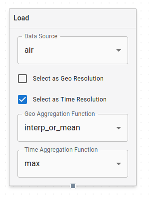

# Data Modeling

With Dojo's Data Modeling tool, users can load features from NetCDF files into a visual graphing flow, perform actions on those features, and generate new datasets from the results.

## Selecting NetCDFs

When you initially land on the Data Modeling page, you'll be prompted to selected registered NetCDFs. If you have a NetCDF that you'd like to use that isn't yet registered in Dojo, follow the steps in [Data Registration](./data-registration) to register it. It will then appear in the list of NetCDF datasets.

You can select as many datasets as you'd like. Once you've selected all your datasets, click `USE THESE DATASETS` on the bottom of the page to move to the next step.

## Building a graph

On the second step, you now have to start building out your graph. Drag and drop the different nodes referenced below from the list of nodes on the right side of the screen onto the dotted surface that covers the majority of the screen. Click on the small circles at the bottom/top of each node, then move your mouse (with the line from the circle) to the circle at the bottom/top of the node you'd like to connect your selected node to. By adding nodes, described below, and connecting them together, you'll create a graph that will allow you to process data from multiple features into new dataset outputs.

### Nodes:

#### Load Node

This starts with selecting Load Nodes. Each Load Node represents one feature from a dataset. You select this feature with the "Data Source" dropdown at the top of the node. You'll see features listed per dataset in this dropdown.

Once you've selected a feature for a Load Node, you can choose to make it the Geo Resolution and/or the Time Resolution for your new dataset. You can only select each of these once in the entire graph, either in the Load Nodes or in the Time/Geo Resolution selectors in the sidebar.

You also need to choose a Geo and Time Aggregation function for each Load Node.

<!-- Note: explain these:
'conserve', 'min', 'max', 'mean', 'median', 'mode', 'interp_or_mean', 'nearest_or_mode',
 -->

#### Threshold Node

#### Join Node

#### Filter By Country Node 
With this node you can filter the data coming out of your selected features by the countries you select in the dropdown. You can select multiple countries.

#### Reduce By Node
<!--
Note: explain these in context
 'lat', 'lon', 'time', 'country'
 -->

#### Save Node
The final step in a graph is adding a Save Node. The Save Node will provide a name and description for the output, provided by the two input fields on the node. 

### Manual Resolution
Below the list of nodes on the right side of the screen, you'll find two inputs where you can manually set your Geo or Time Resolution. You can use these instead of selecting one of your `Load Node` features to be Geo/Time Resolution if you want to set the resolution by hand. If you set it here, you won't be able to select any of the same type of Resolution elsewhere until you clear it. 

### Processing
Once you're done setting up your graph, click the `PROCESS` button to start running the backend process. When it's complete, you'll see a list of the datasets that the process output. 

**PLEASE NOTE** It is important to make sure you have at least one Load Node with a feature selected. Also ensure that all the nodes in your graph are connected before hitting process.