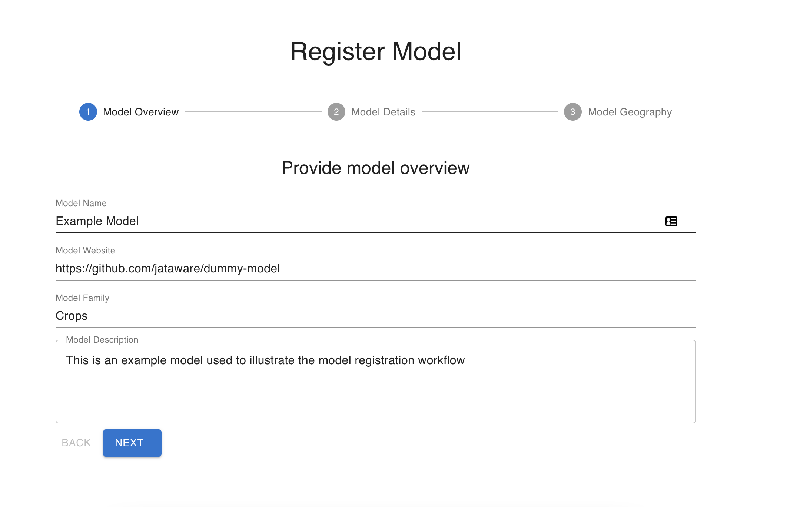
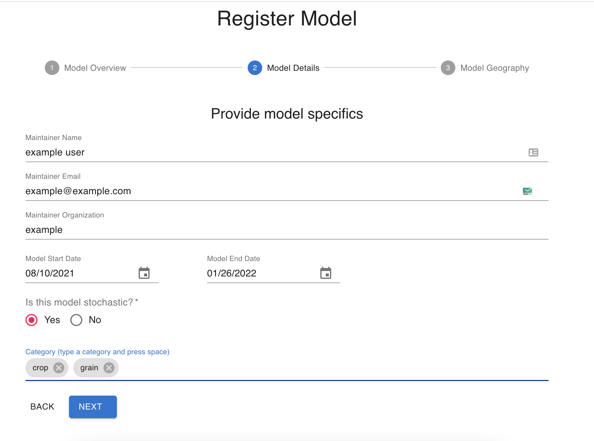
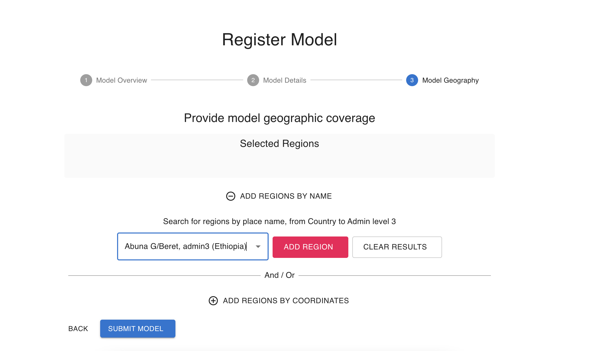
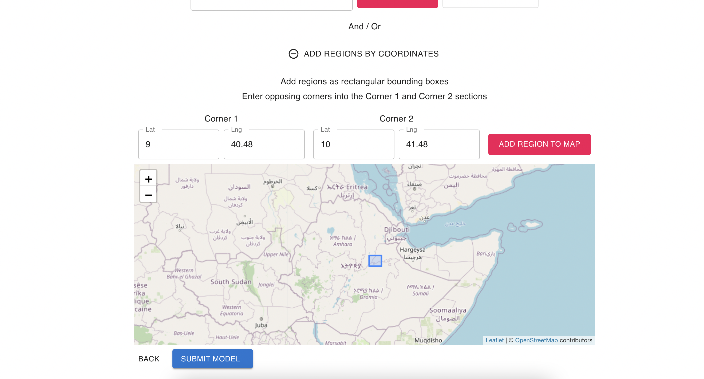
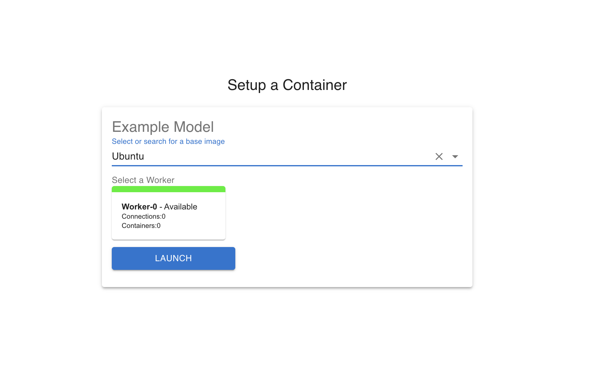
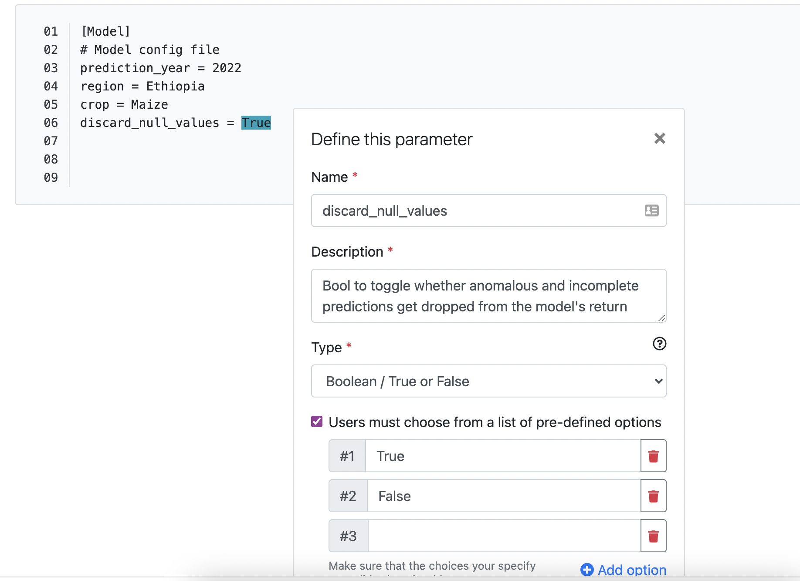
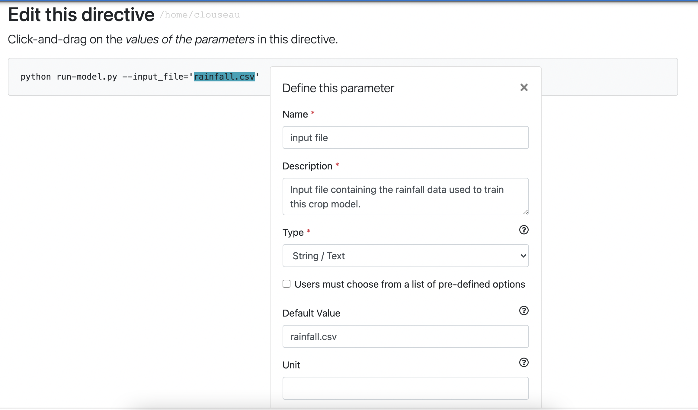

<style>
  .iframe-container {
		text-align:center;
  		width:100%;
  }
</style>

## Model Registration

### Contents

- [Overview](#overview)
- [Model Metadata and Provenance](#model-metadata-and-provenance)
- [Containerization and Execution](#containerization-and-execution)
  - [Build your model](#build-your-model)
  - [Dojo Commands:](#dojo-commands)
  - [Configuration File Annotation](#configuration-file-annotation)
  - [Directive Annotation](#directive-annotation)
  - [Output File Annotation](#output-file-annotation)
  - [Completing the Registration](#completing-the-registration)


## Overview
There are two main activities associated with registering a model to Dojo:

1. **Model Metadata and Provenance**: modelers begin the registration process by providing key metadata about their model and choosing relevant geographic regions so that Dojo can facilitate search and discovery across its model registry.

2. **Containerization and Execution**: next, modelers are directed to a containerization environment. In this environment, modelers teach Dojo how to run their models, how to set parameters, and provide metadata about model output files. The end result is the publication of a Docker image and associated metadata about the registered model.

To get started, visit [https://dojo-modeling.com](https://dojo-modeling.com/). Please reach out to [dojo@jataware.com](mailto:dojo@jataware.com) for credentials or help with the application. 

## Model Metadata and Provenance

To begin the process, Dojo captures metadata about each model and its maintainer. It's important to be as thorough as possible to ensure the end-user can understand at a high-level what each model does, how it does it, and what it produces.



Key definitions:

- `Model Name`: The end-user will see this name when running your model. While spaces and upper/lower case are allowed, _**do not use special characters, to include parenthesis**_.
- `Model Website`: This can be a link to your model repository or another website that you may maintain that provides additional context about your model.
- `Model Family`: Model family refers to a group of models with similar characteristics. If you have several procedures based on the same underlying model family, you can link those models or model procedures here under a common family name of your choosing, such as `LPJmL`. If your model does not have a natural grouping with other models, you can name it under an appropriate category related to your model or repeat your model name.
- `Model Description`: Your description here is the forward-facing documentation about your model that the end-user will see. Include as much information as possible to explain what your model does and what it produces. Include any notes that may be required to explain any model idiosyncrasies. If your model takes a long time to run, you may want to include an estimated run time.

The next page captures general metadata about the model and its maintainer. There is a short demo below, as well as definitions for each field:



Key definitions:

- `Maintainer Name`: The primary point of contact for the model.
- `Maintainer Email`: The primary point of contact's e-mail address. If you have one, a group e-mail is also acceptable.
- `Maintainer Organization`: The organization that developed the model. 
- `Is this model stochastic?`: Check yes or no depending on your model.
- `Category`: Common groupings that you would like your model categorized as. After typing your desired category, press the space bar to add additional categories. The categories associated with your model enable better discoverability of your model when the end-user searches for a broad model-type.

  > Note: Spaces are not allowed when entering your category. To include a multi-word category, replace spaces with underscores. For example, `crop production` would be entered as `crop_production`. 

Next, modelers provide information about the model's geographic coverage. Modelers can add geographic areas by either selecting an area area by name or building a bounding box around an area of interest.

Steps to add a geographic coverage by administration levels: 



1. Click on `ADD REGIONS BY NAME`
2. In the search box, enter a place name, country, or any admin-level 1 through 3.
3. Select your desired region from the dropdown menu.
4. Your selection will appear in the search box: **click on `ADD REGION`** to add it to the `Selected Regions`.
5. Repeat the process to add any other geographic areas.



Steps to add a geographic coverage by building a bounding box:

1. Click on `ADD REGIONS BY COORDINATES`
2. Enter your bounding box coordinates:

 - Corner 1: The latitude and longitude of the northwest corner of your bounding box.
 - Corner 2: The latitude and longitude of the southeast corner of your bounding box.
  
    >Note : Westerly longitudes and Southern latitudes are negative
  
3. Select `ADD REGION TO MAP`

Once you have added your geographic areas, Click `SUBMIT MODEL` to move the next step in the registration process.

## Containerization and Execution

To launch the model execution environment, you will need to select a base image from the available drop-down menu. You may also provide the ID of an existing Debian (Ubuntu) based Docker image on Dockerhub to use as your starting point.

After selecting the appropriate image you should launch your registration worker.



### Building your model

You will build your model image inside the model execution environment (a Docker container). While all models are different, the general approach is to:

- Clone your model code into the container.
- Install any requirements needed to run your model.
- Test model execution. This can be an iterative approach in that you can make several test runs to ensure that you model is running and producing the expected results.
- Once you have a successful model run, Dojo will need to learn how you run your model, what input parameters you want to expose to the end-user, metadata about your output file(s), and the directory where your results are located. [Quick Reference](#quick-command-reference) is a short introduction to the commands you will need followed by more in depth discussions and demonstrations of each command.


### Dojo Commands:
You can leverage the commands below while registering your model:

- `edit <filename.ext>`: launch editor to modify any of your files.
- `config <path_to_config_file.json>`: launch a tool to define and annotate parameters.
- `tag <path_to_outputfile.csv>`: launch an annotation tool to define and classify the columns of your data.
- `accessory <path_to_accessory.png> "caption here"`: tags an output accessory file such as an image or video; caption is optional

### Configuration File Annotation
If your model uses configuration files to set parameters or tunable knobs you will need to annotate them in order to expose these parameters to Dojo end-user. Once the annotation window is launched, you can annotate each parameter and provide metadata and detailed information. 

With Dojo, you can annotate any plain text/ascii configuration file, including `.txt`, `.yaml`, `.json`, `.xml`, etc. 

Below is an example with details about each field following.



To launch the config annotation window run (replace `<path_to_config_file.json>` with the appropriate file path and name):


  ```
  config <path_to_config_file.json>
  ```

1. Selecting your parameter. Only highlight the parameters you wish to expose to the end-user. After highlighting _only the parameter value you wish to expose_ (i.e. do not highlight the quotes of strings or the variable name), Dojo will launch an annotation window to describe your parameter.
2. Available fields:
 - `Name`: The natural language name that want to call your parameter; string only and spaces are allowed.
 - `Description`: As with your model description, the parameter description should be detailed. The end-user will rely on this description to gain an understanding of the parameter. For non-standard formats, be sure to include not only an explanation, but also an example. For example, if choosing input Parameter A requires the end-user to select a subset from input Parameter B, be sure to include that here. 
 - `Type`: Available options include string, integer, float, Date/time, and boolean. Choose the type from the dropdown that classifies your parameter.
 - `Pre-Defined Options`: A checkbox option if you would like to constrain the available parameter values to the end-user. Selecting the checkbox will expand the annotation window and allow you to enter any desired parameter values. **These values must align with your model**. I.E., if your model is expecting an underscore between countries with 2+ names, then your entry here must include the underscore. Select `Add option` as needed to include additional parameter values.
 - `Default Value`: While not required, it is recommended to provide a default parameter value.
 - `Unit`: Required if applicable to your parameter. There is a field below to describe the unit, so here simply enter the units such as KG/HA or kilograms per hectare.
 - `Unit Description`: Add detail here to fully explain the parameter's unit. For example, kilograms of crop produced per hectare during the rainy season.
 - `Data Type`: Available options include nominal, ordinal, numerical, and freeform. Choose the appropriate data-type from the dropdown for your parameter.
 - `Allow users to change this value`: A checkbox option. If you would like to expose this parameter to the end-user, keep the box checked. If you only want to provide additional information about the parameter to enhance explainability, uncheck the box. The end-user will then not be able to change the value but will be able to view the details of the parameter.
 - `Save`: Select save when complete. You can also select cancel should you no longer want to annotate the parameter and your updates will not be saved.

Repeat the above process for every applicable parameter value in your configuration file. Once complete, select save in the upper right-hand corner; this will save your annotated configuration file in Dojo. You may annotate multiple configuration files.

> Note: upon model execution, Dojo accepts parameter selections from end users and "rehydrates" the relevant config files with those parameter selections.

### Directive Annotation
On the right-hand side of the terminal there is a dialog box; some entries will be flagged with an option to `MARK AS MODEL DIRECTIVE`. Next to the appropriate model run command, select this flag to launch an annotation window. Annotating the directive allows you to expose and describe parameters to the end-user.  Below is an example with details about each field following.



The same process applies to directive annotations as applied to [configuration annotation](#configuration-file-annotation).

Repeat the annotation process for every applicable parameter value in your model execution directive. Once complete, select save in the upper right-hand corner; this will save your annotated directive in Dojo.

> Note: your model can have only one directive. If running your model is a multi-step process, you must combine those steps into a single executable script or command.


### Output File Annotation
Once your model has run you will need to annotate your output file(s). This step provides the required metadata to geocode, associate and format columns, and convert your output to a Geotemporal dataset. 

> Currently, Dojo supports `.csv`, `.nc` (NetCDF), and `.tiff` (GeoTIFF). The files must have these correct extensions. For example, a `.txt` file that is `,` delimited, though technically a "CSV", will not be handled correctly by Dojo.

To launch the output file annotation tool, run (replace `<path_to_output_file.csv>` with the appropriate file path and name):
```

tag <path_to_output_file.csv>
```

Below is a demonstration how to invoke the model output annotation interface:


For a detailed description on how to do this, please go to [Data Registration](./data-registration.md). Some of the form elements differ slightly from the data registration workflow, but the annotation process remains the same.


### Completing the Registration
When you have completed the above steps, you are ready to publish your model image to DockerHub. This image will be utilized downstream from the model registration process and allow end-users to change exposed parameters, run the updated model, and then inspect and conduct analyses with the results.

As a recap, before publishing your image, you should have:

1. Uploaded your model.
2. Installed any dependencies.
3. Iteratively tested your model and verified model behavior / results.
4. For directive-type models: annotated all desired parameters on the command line; this includes both parameters you want to expose and parameters you wish to remain static but wish to provide additional explainability.
5. For configuration-type models: annotated all desired parameters in the configuration file.
6. Annotated the model output file(s) to define the metadata, geocode, and transform your output to a Geotemporal dataset.
7. Defined the location / directory of your output file(s). This is required in order to mount your model output and complete the geocoding and geotemporal transform of the results.

If you have done all the above, you are ready to publish your image. Select `END SESSION`; you will be asked if you want to publish the image. Select `yes` and monitor the publication progress. When complete, you can go to https://hub.docker.com/repository/docker/jataware/dojo-publish and look under the tags section to verify that your image was pushed to DockerHub. You may need to expand the tags section.

> Note: for Dojo registration to be successful, **you must publish** your model!

**IMPORTANT**
If for some reason you do not wish to publish a container image, you must select `ABANDON SESSION`. As you noticed when launching into the model execution environment, there are a limited number of workers available. If you do not abandon your session, the container will continue to run and your worker will not be available to others wishing to register a model.